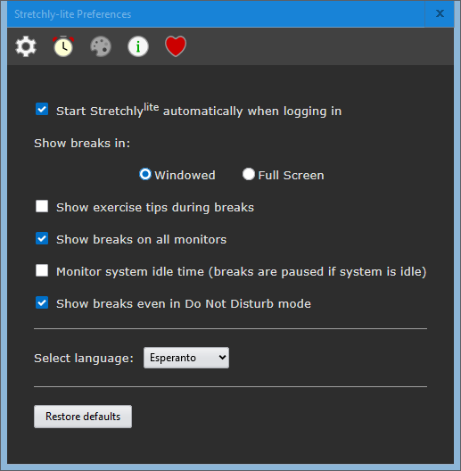

# Stretchlylite

This is a :construction: NON-FUNCTIONAL :construction: remake of [Stretchly](https://github.com/hovancik/stretchly).  

The original is an [Electron](https://www.electronjs.org/) application.  This remake uses [Rust](https://github.com/sciter-sdk/rust-sciter) and [Sciter.JS](https://github.com/c-smile/sciter-js-sdk), and is merely an experiment.

## Building

On Windows, place [sciter.dll](https://github.com/c-smile/sciter-js-sdk/blob/main/bin/windows/x64/sciter.dll) in this folder before running `cargo run`.

The executable should be less than 0.5 megabytes.  `sciter.dll` is about 8 megabytes, so the total will be less than 10 megabytes. 

## Screenshots

